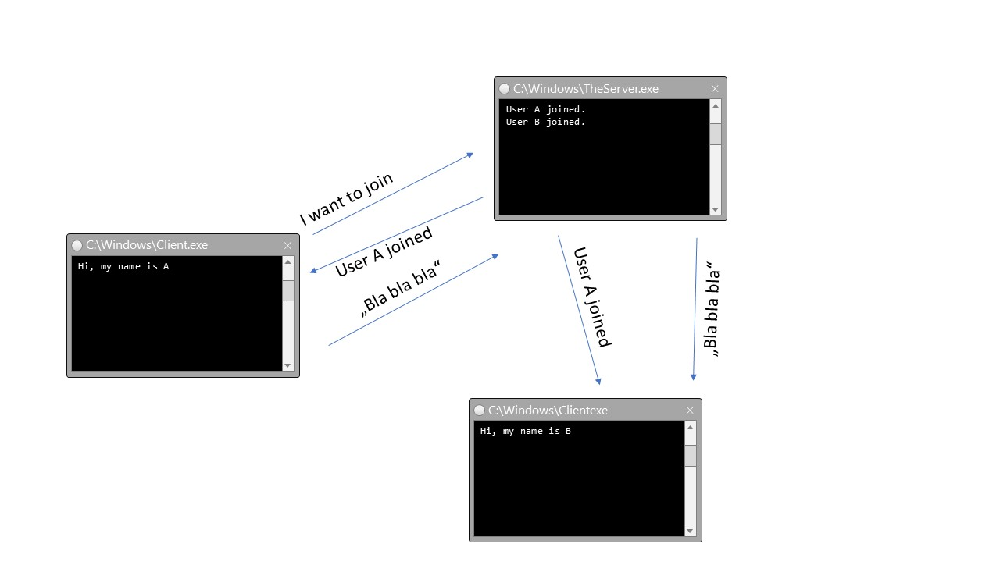

## Demo 1 - Chat

#### Description
Client registers (command) to the chat server. Chat server broadcasts (event) the new clients name.
Client sends message (command) to the server. Server broadcasts (event) the message to all clients.

This example uses the [Shuttle.esb](https://github.com/Shuttle/shuttle-esb) library on top of MSMQ transportation.
So there's nearly no prerequisite to run this sample except MSMQ.

#### How to start the example

* Open the solution
* Compile all projects
* Chat.Server: Set `Shuttle.Core.Host.exe` as the Start external program option by navigating to the bin\debug folder of the server project.
	* It may be necessary to build the solution before the Shuttle.Core.Host.exe executable will be available in the bin\debug folder.

#### MSMQ Setup
https://msdn.microsoft.com/en-us/library/aa967729(v=vs.110).aspx

__Short version__:
* Start Windows Feature Wizard:
  * Start -> Type "Feature", Choose "Turn Windows Features On or Off"
  * or Control Panel -> Programs -> "Turn Windows Features On or Off"
* Enable `Microsoft Message Queue (MSMQ) Server Core`. All other MSMQ sub-options should be disabled.
