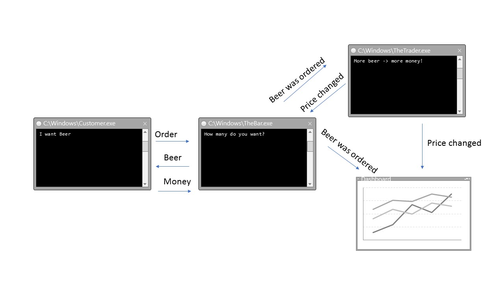

## Demo 2 - Beer market

#### Description
Customer orders a beer (command). "The Bar" send a beer back (reply) and publishes the order (event). "The trador" receieves the orders and calculates a new beer price depending upon the amount of beers ordered in recent time.
The new beer price will be published and "the bar" uses it for the next order.
The dashboard collects all events and visualizes it.

This example uses the [Rebus](https://github.com/rebus-org/Rebus) library on top of MSMQ transportation.
So there's nearly no prerequisite to run this sample except MSMQ.

#### MSMQ Setup
https://msdn.microsoft.com/en-us/library/aa967729(v=vs.110).aspx

__Short version__:
* Start Windows Feature Wizard:
  * Start -> Type "Feature", Choose "Turn Windows Features On or Off"
  * or Control Panel -> Programs -> "Turn Windows Features On or Off"
* Enable `Microsoft Message Queue (MSMQ) Server Core`. All other MSMQ sub-options should be disabled.
