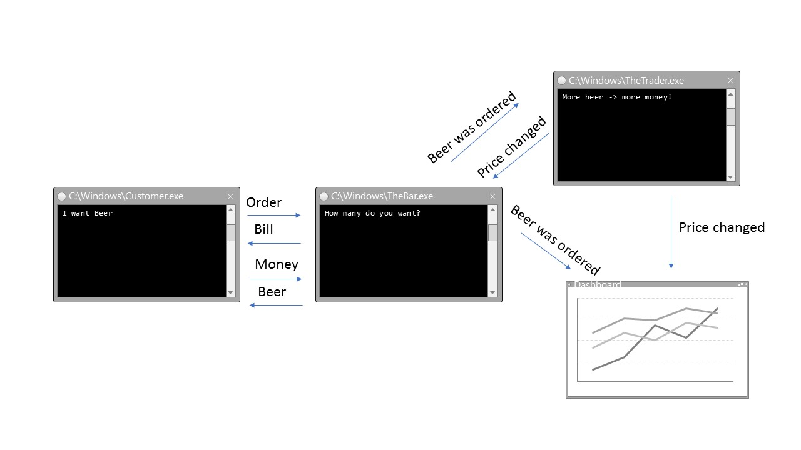

## Demo 2 - Beer market (with saga)

#### Description

Customer orders a beer (command). "The bar" requests the price. The customer pays the bill. "The Bar" send a beer back (reply) and publishes the order (event). "The trador" receieves the orders and calculates a new beer price depending upon the amount of beers ordered in recent time.
The new beer price will be published and "the bar" uses it for the next order.
The dashboard collects all events and visualizes it.

This example uses the [Rebus](https://github.com/rebus-org/Rebus) library on top of MSMQ transportation.
So there's nearly no prerequisite to run this sample except MSMQ.

In difference to the previous [demo](../Demo2-Beer_Market) this version uses a [process manager](https://github.com/rebus-org/Rebus/wiki/Process-managers) ("Saga") to coordinates the incomming and outcomming messages.

#### MSMQ Setup
https://msdn.microsoft.com/en-us/library/aa967729(v=vs.110).aspx