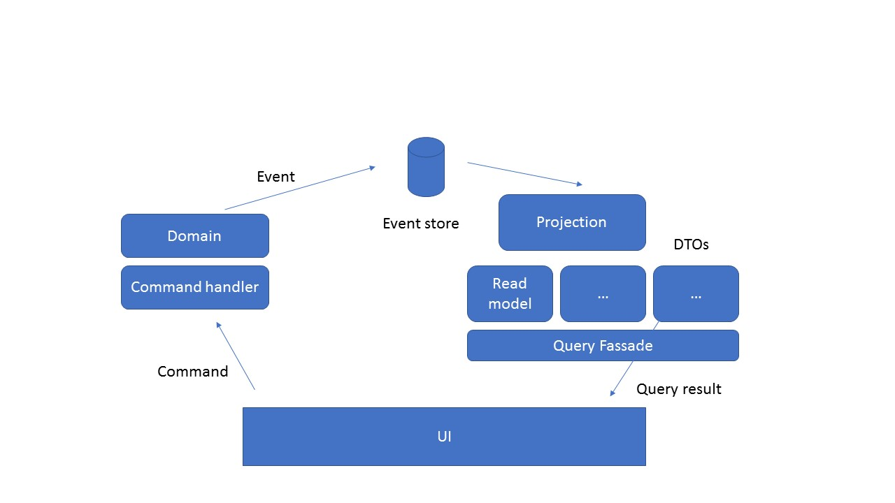

## Demo 3 - CQRS

#### Description
The web ui shows a list of open application for leaves. The user can select an item an "accepts" it. 
This accept command will be send to the domain service and will be proceed there. The domain service publishes
a ApplicationAccepted event which will be received by the Query service. This service updates its two read models.
The ui queries these read models in order to show the open and accepted applciations.

This example uses the [MassTransit](http://masstransit-project.com/) library on top of [RabbitMQ](https://www.rabbitmq.com/) transportation.

The data of the domain service and query service are stored in an embedded RavenDb database. The RavenDb Studio is accessable using http://localhost:50011 (query service) and http://localhost:50022 (domain service).

#### Initial data
Please call the http://localhost:5002/api/Applications/test url to create initial data.

#### RabbitMQ Setup
I used the [rabbitmq docker image](https://hub.docker.com/_/rabbitmq/) which gets set up very fast.
You can use the `runRabbitmq.ps1` to start a rabbitMQ container. The management UI is available under http://172.17.0.2:15672.

Caution: Please have a look at [this article](http://www.dotnetcatch.com/2016/11/11/access-a-docker-container-from-the-docker-for-windows-host/) desribing a "problem" when trying to access URLs of a docker image on Windows.