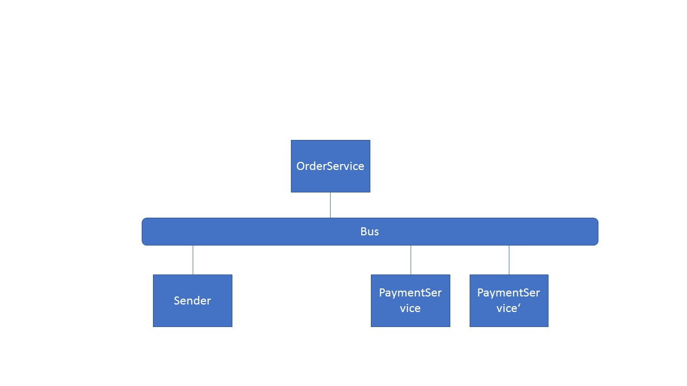

## Demo 4 - Scalability

#### Description
This demo was written to show how easily nodes can be added to the message bus to distribute the work load.

The sender creates a simple command which the Order service handles. This service publishes an event which is subscribed by the Payment service.
You can test the behaviour by simply start new instances of the services.

This example uses the [Rebus](https://github.com/rebus-org/Rebus) library on top of [RabbitMQ](https://www.rabbitmq.com/) transportation.

#### RabbitMQ Setup
I uses the rabbitmq docker image which gets set up very fast.